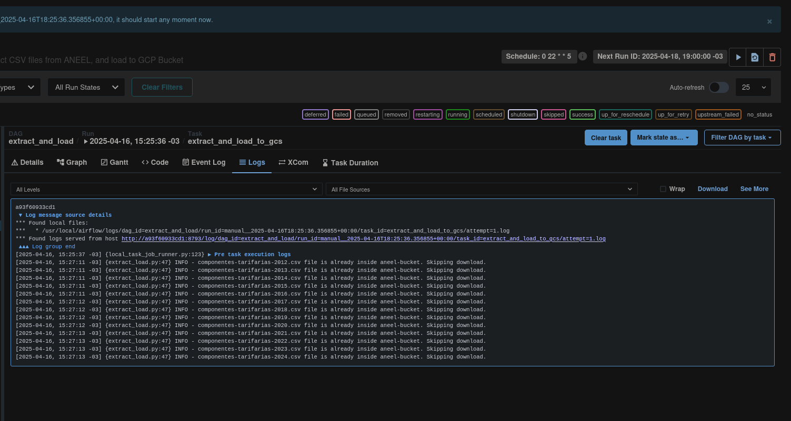
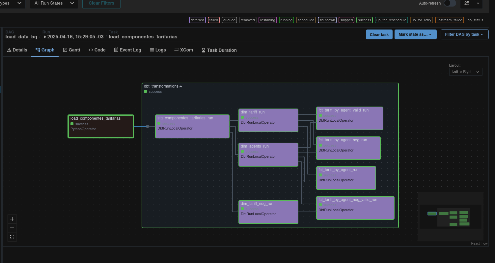

# ANEEL Electricity Tariff Analysis

<div align="center">
    
</div>

## DataTalks Data Engineering Zoomcamp 2025 Capstone

This project is my capstone for the Data Engineering Zoomcamp, organized by DataTalks. I focus on building an end-to-end **Extract, Load, and Transform (ELT)** pipeline using data from the Open Data Plan (PDA) of Brazil’s Agência Nacional de Energia Elétrica (ANEEL), specifically targeting tariff components applied to electric energy. **The objective here is to serve data in a batch workflow to analyze the different eletric energy tariffs applied by several agents authorized by ANEEL in Brazil**.

My personal goal with this project is to demonstrate my proficiency in the entire data engineering lifecycle—from ingestion and transformation to storage and analysis—showcasing my ability to design scalable, efficient, and reliable data solutions.

## Table of Contents
- [Business Problem](#business-problem)
- [Project Evaluation Disclaimer](#project-evaluation-disclaimer)
  - [Prerequisites](#prerequisites)
  - [Orchestration Choice](#orchestration-choice)
  - [Resource Requirements](#resource-requirements)
  - [Why Astronomer?](#why-astronomer)
  - [Batch Processing Design](#batch-processing-design)
  - [OS Compatibility](#os-compatibility)
  - [Data Warehouse Optimization Status](#data-warehouse-optimization-status)
  - [Thank You](#a-huge-thank-you)
- [1.0 Overview](#10-overview)
  - [1.1 What is ANEEL?](#11-what-is-aneel)
  - [1.2 About its PDA - Plano de Dados Abertos (Open Data Plan)](#12-about-its-pda---plano-de-dados-abertos-open-data-plan)
  - [1.3 Project Goals](#13-project-goals)
  - [1.4 Dataset](#14-dataset)
- [3.0 How to Reproduce This Project](#30-how-to-reproduce-this-project)
  - [3.1 Requirements and Tools Used](#31-requirements-and-tools-used)
  - [3.2 Necessary Steps](#32-necessary-steps)
- [4.0 Project Components](#40-project-components)
  - [4.1 - Cloud Infrastructure: Google Cloud Platform & IaC with Terraform](#41---cloud-infrastructure-google-cloud-platform--iac-with-terraform)
  - [4.2 - Data Ingestion (Batch Workflow): Orchestration with Astronomer](#42---data-ingestion-batch-workflow-orchestration-with-astronomer)
  - [4.3 - Data Warehouse: BigQuery](#43---data-warehouse-bigquery)
  - [4.4 - Transformation: DBT](#44---transformation-dbt)
  - [4.5 - Dashboard: Looker Studio](#45---dashboard-looker-studio)
- [5.0 Next Steps](#50-next-steps)

## Business Problem
As part of regulatory monitoring for Brazil's electricity sector, ANEEL (National Electric Energy Agency) requires ongoing analysis of tariff components applied by authorized agents. Our team has been tasked with:

1. Identifying Anomalous Tariff Patterns: Analyzing both positive and negative tariff values to detect potential irregularities or market trends.

2. Agent Performance Ranking: Determining the top 10 agents with the highest accumulated positive tariff values (indicating revenue generation) and the top 10 with the most significant negative values (indicating potential subsidies or penalties).

3. Active Tariff Volume Assessment: Evaluating the financial impact of currently valid tariffs by quantifying the monthly and yearly transaction volumes still in circulation among agents.

This analysis will empower ANEEL’s regulatory teams to monitor compliance with tariff policies, identify agents with extreme tariff deviations for further auditing and assess the ongoing financial footprint of active tariffs on the energy market.

**MORE ABOUT ANEEL AND ITS ROLE IN BRAZIL BELOW**

## <span style="color:red">**Project Evaluation Disclaimer**</span>  

### **Prerequisites**  
Before running this project, ensure you have a GCP account and the following installed:  
- **Docker**  
- **Anaconda** (or an alternative environment/package manager; note that I encountered issues with Poetry during testing)  
- **Terraform CLI** ([installation guide](https://developer.hashicorp.com/terraform/tutorials/aws-get-started/install-cli))  
- **Astronomer CLI** ([installation guide](https://www.astronomer.io/docs/astro/cli/install-cli))

More tools are listed below in **3.1 Requirements and Tools Used** section, but those above are the tools you will need before running this project by yourself.

### **Orchestration Choice**  
While the Zoomcamp originally used **GCP + Kestra**, I opted for **Apache Airflow** to align with industry demand in Brazil (where I'm based). Airflow is more widely adopted here, and this choice better reflects my professional focus as a Data Engineer.  

### **Resource Requirements**  
All referenced resources fall under the **GCP Free Tier**. You can run with a VM, which, For optimal performance, I recommend:  
- Machine type: **E2 or N2**  
- Minimum RAM: **8GB**  

### **Why Astronomer?**  
I deployed Airflow via **Astronomer** for its streamlined DBT integration, which simplifies production-grade workflows. This combination improved my pipeline's maintainability and scalability.  

### **Batch Processing Design**  
I intentionally avoided Apache Spark for batch loading, relying instead on **Astronomer + DBT**. DBT's native multi-threading handled my transformation workloads efficiently without Spark's overhead.  

### **OS Compatibility**  
This project was developed and tested on **Ubuntu Linux**. While instructions are Linux-centric, adjustments may be needed for Windows/Mac environments.  

### **Data Warehouse Optimization Status**
The current implementation does not include optimization for the BigQuery tables that comprise the Data Warehouse. At this stage, I haven't developed an automated solution for this optimization process. 

I acknowledge that this limitation results in a 2-point penalty according to project evaluation criteria, and I accept this penalty as part of the current project state.

### **A Huge Thank You!**
Just wanted to say a huge thanks for taking the time to check out my project. Your feedback and evaluation will help me become a better data engineer. Really appreciate.

## **1.0 Overview**
### **1.1 What is ANEEL?**

The ANEEL, or Agência Nacional de Energia Elétrica (National Electric Energy Agency), is a special regime autarchy linked to the Brazilian Ministry of Mines and Energy, established to regulate the Brazilian electricity sector. It was created through Law No. 9.427/1996 and Decree No. 2.335/1997, beginning its operations in December 1997. 

ANEEL plays a critical role in regulating and overseeing the sector, with responsibilities that include regulating the generation (production), transmission, distribution, and commercialization of electric energy. Additionally, the agency is responsible for monitoring, either directly or through agreements with state agencies, concessions, permits, and electric energy services. 

Other key functions include implementing federal government policies and guidelines related to the exploitation of electric energy and the utilization of hydroelectric potential, setting tariffs, mediating administrative disputes between sector agents and consumers, and promoting the granting of concessions, permits, and authorizations for energy projects and services, as delegated by the Federal Government.

Source: **https://www.gov.br/aneel/pt-br/acesso-a-informacao/institucional/a-aneel**

### **1.2 About its PDA - Plano de Dados Abertos (Open Data Plan)**

The National Electric Energy Agency (ANEEL) established its Plano de Dados Abertos, PDA, or Open Data Plan for 2022-2024 through Ordinance No. 6,785 of October 24, 2022. The PDA serves as a strategic framework for planning and coordinating data disclosure initiatives, aligning with national regulations and the Open Government Partnership (OGP), a multilateral initiative co-founded by Brazil.

Open data refers to publicly accessible, machine-readable information released under open licenses, allowing free use and cross-referencing while requiring proper attribution (as per Decree No. 8,777/2016 and CGINDA Resolution No. 3/2017). ANEEL's data disclosure prioritizes public interest, transparency, efficiency, and effectiveness, incorporating datasets from the 2020-2022 PDA and adopting prioritization criteria from CGINDA's guidelines.

The PDA aims to:

1. Release data in open formats, ensuring transparency and privacy;

2. Encourage civic applications and new business opportunities using open data;

3. Raise public awareness about open data's potential;

4. Improve data quality and timeliness;

5. Foster social oversight and government interoperability;

6. Strengthen transparency and access to public information.

Source: **https://dadosabertos.aneel.gov.br/about**

### **1.3 Project Goals**  
- **Build a scalable ELT pipeline** using Terraform for infrastructure as code  
- **Extract and transform ANEEL's tariff data** using Apache Airflow (Astronomer) and DBT  
- **Load processed data** into BigQuery for analysis  
- **Create interactive dashboards** with Looker Studio for data visualization and insights  

### **1.4 Dataset**
The dataset in question can be found in the PDA repository at the following link: https://dadosabertos.aneel.gov.br/dataset/componentes-tarifarias. It contains the values of Energy Tariffs (TE) and Distribution System Usage Tariffs (TUSD), resulting from the tariff adjustment processes of electric energy distribution companies. It is a public repository maintained by ANEEL, created on August 25, 2023, and updated weekly, with coverage from 2010 to the present. The data is provided in separate files, one for each year. The file for the current year is updated weekly, requiring weekly downloads and processing. These datasets are available in multiple formats: CSV, TSV, XML, and JSON.

Here's the tabularized version of your field descriptions in English:

| Field Name                  | Data Type          | Size  | Description |
|-----------------------------|--------------------|-------|-------------|
| **DatGeracaoConjuntoDados** | Date               | -     | Date of automatic processing when generating the open dataset for publication. |
| **DscResolucaoHomologatoria** |  String   | 200   | Information about the resolution number and date of the Homologatory Resolution. |
| **SigAgente**               | Numeric            | 10    | Abbreviation representing the name of Agents* regulated by ANEEL. |
| **NumCPFCNPJ**              |  String   | 14    | CNPJ or CPF** number of the audited entity (organization). |
| **DatInicioVigencia**       | Date               | -     | Start date of tariff validity. |
| **DatFimVigencia**          | Date               | -     | End date of tariff validity. |
| **DscBaseTarifaria**        |  String   | 100   | Application Tariff, Economic Base, and CVA. The Application Tariff is used by distributors for billing consumers, generators, and distributors, with values specified in the Homologatory Resolution. The Economic Base Tariff and CVA*** are used strictly for tariff calculations. |
| **DscSubGrupoTarifario**    |  String   | 255   | Grouping of consumer units according to tariff subgroups: A1 (≥230 kV), A2 (88-138 kV), A3 (69 kV), A3a (30-44 kV), A4 (2.3-25 kV), AS (underground), B1 (residential), B2 (rural), B3 (other classes), B4 (public lighting). |
| **DscModalidadeTarifaria**  |  String   | 255   | Set of tariffs applicable to energy consumption and demand components, as defined by Normative Resolution No. 1000/2021: conventional; time-based (green/blue), white, prepaid, generation, and distribution. |
| **DscClasseConsumidor**     |  String   | 255   | Classification of consumer units by energy use purpose (Normative Resolution No. 1000/2021): residential; rural; public lighting; N/A (industrial; commercial/services; government; public service; self-consumption). |
| **DscSubClasseConsumidor**  |  String   | 255   | Subclassification of consumer units as a subdivision of classes. |
| **DscDetalheConsumidor**    |  String   | 255   | Complementary variables used in tariff definitions regarding eligibility criteria. |
| **DscPostoTarifario**       |  String   | 255   | Tariff period identifier (time-based differentiation per Normative Resolution No. 1000/2021). |
| **DscUnidade**              |  String   | 5     | Tariff unit (R$/kW or R$/MWh for TUSD; R$/MWh for TE). |
| **SigAgenteAcessante**      |  String   | 20    | Applicable to nominal tariffs for specific users (distributors/consumers/generators). Abbreviation as registered in ANEEL's agent database (e.g., AmE, CEMIG-D). |
| **DscComponenteTarifario**  |  String   | 100   | Description of tariff components per Module 7 of PRORET: "Components of the Distribution System Usage Tariff (TUSD) and Energy Tariff (TE)." |
| **VlrComponenteTarifario**  | Numeric (18,9)     | -     | Value of TE and TUSD components according to **DscUnidade**. |


    * The Agents from ANEEL can be find in this dataset: https://dadosabertos.aneel.gov.br/datastore/dump/64250fc9-4f7a-4d97-b0d4-3c090e005e1c?bom=True

    ** The CPF is a unique ID number for individuals in Brazil. It’s like a Social Security Number (SSN) in the U.S. or a National Insurance Number in the UK. The CNPJ is a unique ID number for companies and organizations in Brazil. It’s like an Employer Identification Number (EIN) in the U.S. or a Company Registration Number in other countries. 

    *** CVA is the records the of the variation, between annual tariff adjustments, of some cost items for distribution companies, such as the purchase of electric energy plant and certain tariff charges in the electric sector.

[Data Dictionary, version 1.0, created in August 25, 2023](https://dadosabertos.aneel.gov.br/dataset/613e6b74-1a4b-4c48-a231-096815e96bd5/resource/cb1d06a8-5b4c-45a0-bb41-9e9546cc578b/download/dm-componentes-tarifarias.pdf)

## **3.0 How to Reproduce This Project**

### **3.1 Requirements and Tools Used**
- Google Cloud Platform
- Docker
- Terraform
- Apache Airflow/Astronomer
- DBT Core
- Python 3.12

### **3.2 Necessary Steps**

1. **Clone this repository**

2. **Create a GCP Account**

3. **Create a new Service Account and download the JSON credentials**:
   - Go to the IAM & Admin Console and navigate to Service Account
   - Create a new user and assign the necessary permissions:
     - **BigQuery Admin**
     - **Storage Admin**
   - Generate a new Key for the user and store it in the [`creds`](./creds) folder, renamed as `gcp.json`

4. **Set up the infrastructure using Terraform**:
   - Navigate to the [`terraform`](./terraform/) folder
   - Create a `terraform.tfvars` file with your project details:
     ```hcl
     credentials = "../creds/gcp.json"
     project = "<project ID>"
     ```
   - Initialize and apply the Terraform configuration:
     ```bash
     terraform init
     terraform plan
     terraform apply -auto-approve
     ```

5. **Prepare Python environment, Astronomer and DBT**:
   - Navigate to the [`airflow`](./airflow/) folder
   - Create a `docker-compose.override.yml` file with your GCP credentials path:
     ```yml
     services:
       scheduler:
         volumes:
           - <absolute path of your gcp.json file>:rw
       webserver:
         volumes:
           - <absolute path of your gcp.json file>:rw
       triggerer:
         volumes:
           - <absolute path of your gcp.json file>:rw
     ```
   - Create a `.env` file with these variables:
     ```
     GOOGLE_APPLICATION_CREDENTIALS=/usr/local/airflow/gcloud/gcp.json
     GCP_BUCKET=aneel-bucket
     LOCATION=southamerica-east1
     PROJECT_ID=<project id>
     BQ_PROJECT=<project id/bigquery id>
     BQ_DATASET=raw_data
     BQ_TABLE=componente_tarifarias
     ANEEL_DATASET_URL=https://dadosabertos.aneel.gov.br/dataset/613e6b74-1a4b-4c48-a231-096815e96bd5
     ```
   - Start Astronomer containers:
     ```bash
     astro dev start
     ```
     Note: On Linux/Mac, you may need to run `sudo chmod -R 777 .` first
   - Access Airflow at `localhost:8080` to confirm it's running
   - Create a Python 3.12 environment and install packages from [`requirements.txt`](./requirements.txt)
   - Configure DBT by creating a `profiles.yml` file in either:
     - [`airflow/dags/dbt/aneel_dw/`](./airflow/dags/dbt/aneel_dw/)
     - `~/.dbt/profiles.yml` (or equivalent Windows location)
     ```yml
     aneel_dw:
       outputs:
         dev:
           dataset: data_warehouse
           job_execution_timeout_seconds: 300
           job_retries: 1
           keyfile: <absolute path of your gcp.json file>
           location: SOUTHAMERICA-EAST1
           method: service-account
           priority: interactive
           project: <project id>
           threads: 4
           type: bigquery
       target: dev
     ```
   - Test the DBT connection:
     ```bash
     dbt debug
     ```

6. **Run the Apache Airflow pipelines**:
   - Access Airflow at `localhost:8080` (credentials: admin/admin)
   - Manually trigger the `extract_and_load` DAG
   - After completion, trigger the `load_data_bq` DAG
   - Note: By default these run Fridays at 22:00 and 23:00 respectively

7. **Create a Looker Studio dashboard**:
   - Access [Looker Studio](https://lookerstudio.google.com/)
   - Connect to BigQuery and select the fact tables
   - Note: You may need to:
     - Activate the Looker API
     - Grant yourself Looker Studio access via IAM

## **4.0 Project Components**

### **4.1 - Cloud Infrastructure: Google Cloud Platform & IaC with Terraform**
The project primarily utilizes two GCP services:  
- **Cloud Storage Bucket**: Used to affordably and conveniently store spreadsheets from ANEEL's website, accessible through IAM-managed credentials.  
- **BigQuery**: Serves as both the raw data repository and dimensional data warehouse.  

A schema named `raw_data` was created to receive data directly from the Storage Bucket. With the exception of credentials, all infrastructure was provisioned using **Terraform**, which enabled:  
- Protection of environment variables through `terraform.tfvars`  
- Easy testing of different infrastructure locations due to straightforward refactoring  

### **4.2 - Data Ingestion (Batch Workflow): Orchestration with Astronomer**
Workflow orchestration was implemented using **Apache Airflow** deployed via **Astronomer** (running on Docker containers), with native **DBT** integration through the `astronomer-cosmos` package.  

**Key DAGs**:  
1. [`extract_load.py`](./airflow/dags/extract_load.py):  
   - Handles spreadsheet ingestion to the Bucket  
   - Checks for existing files to avoid redundant downloads (only downloads current-year spreadsheets as they're continuously updated)  

2. [`load_to_bq.py`](./airflow/dags/load_to_bq.py):  
   - Manages data transfer from the Bucket to BigQuery's `raw_data` schema  

<div align="center">
    
</div>

*Implementation Note*: While manual triggering is required for initial load and project evaluation, the DAGs are scheduled to run automatically every Friday at 22:00 and 23:00 respectively.

### **4.3 - Data Warehouse: BigQuery**
The warehouse was created using **Terraform**, beginning with a schema for raw data. Subsequent schemas were built in **BigQuery** using **DBT**.  

**Current Limitation**: The warehouse has not been optimized (no clustering or partitioning). This was intentional, as we're exploring ways to automate optimization through code. **This improvement is planned for a future iteration**.

### **4.4 - Transformation: DBT**
Data transformation was implemented with **DBT Core**, orchestrated through Astronomer using the `astronomer-cosmos` package. The workflow follows three stages:  

1. **`stg` models**:  
   - Receive data from `raw_data`  
   - Handle data type conversions  

2. **`dim` models**:  
   - Isolate agent and tariff dimensions  

3. **`fact` models**:  
   - Organize tariff values (positive/negative) by ANEEL approval dates

Schema creation was managed automatically by DBT.  

<div align="center">
    
</div>

### **4.5 - Dashboard: Looker Studio**
The dashboard was developed using **Looker Studio**, Google's native BI tool, with two dedicated pages:  

**Page 1: Positive Tariffs**  
**Page 2: Negative Tariffs**  

Both pages share similar structures but analyze different value types. Key components include:  

**Filters**:  
- `sig_nome_agente` (tariff-receiving agent)  
- `sig_nome_agente_acessante` (organization used by the agent)  

**Metrics**:  
- `Record Count` (total fact table entries)  
- `Number of Agents` (unique agents)  

**Visualizations**:  
- `TOP 10 Agents by Values` (Page 1) / `TOP 10 Agents Neg Values` (Page 2)  
- `Positive/Negative Tariff Values Over Time` (time series by approval month/year)  

**Access Options**:  
1. [PDF Export](./documents/ANEEL_Electricity_Tariff_Analysis.pdf)  
2. [Interactive Dashboard](https://lookerstudio.google.com/reporting/1150f77e-5e0c-4b16-87d6-f8c59d9e56dc) *(recommended)*


## **5.0 Next Steps**
This project has significant opportunities for enhancement. I plan to implement the "Going the Extra Mile" requirements from the course repository, which include:

- Implementing comprehensive testing procedures
- Integrating Makefile automation
- Establishing a CI/CD pipeline

Also, additional planned improvements can be done towards a better code: conducting a thorough review of all DAGs, refactoring code for better modularity and streamlining pipeline components where possible. Also while this implementation currently uses GCP services, I intend to migrate components to AWS or Azure with the objective to gain hands-on experience with multi-cloud architectures and compare service offerings across platforms.